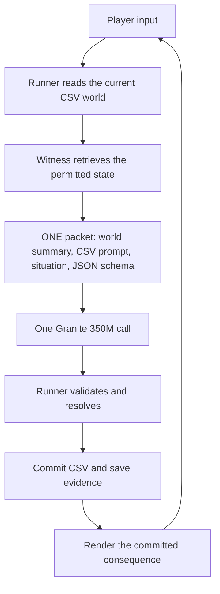

# MochEpoch

Tiny Model Civilizations Browser Game. A playground for coherence across tiny model decisions and a persistent factual world.

## Question

Can a civilization-like game emerge from CSV world state, scoped Witness calls, Granite 350M JSON reasoning, and deterministic game execution, without explicitly programming trust, morality, friendship, loyalty, or civilization?

## Design



`world/world.csv` is the search list. Type selects the folder; name selects the CSV. Witness constructs the complete model input. Granite proposes an action. Deterministic code decides what happens and commits the next CSV state.

The complete [implementation plan](docs/MOCK_EPOCH_IMPLEMENTATION_PLAN.md) defines the component contracts, resolver branches, failure handling, and conditional experiments toward civilization.

## Current status

Repository setup is in place: the plan, project instructions, six seed CSV files, and a source validation command.

| Experiment | Status |
| --- | --- |
| Gate 0: actual Granite call in the target browser | Pending |
| Gate 1: one model decision, one CSV mutation, one visible consequence | Pending |
| Gate 2: correct next interaction after restart and CSV-only restore | Pending |
| Gate 3: failure and recorded-output replay checks | Pending |

No model inference, browser game, or persistence result is claimed by this setup. Runtime dependencies and exact model revisions will be pinned when Gate 0 is implemented and exercised.

## First experiment

One room. One player. One model-controlled character, Ada. One stone held by Ada.

The player asks for the stone. One Witness packet is sent to Granite 350M. The resolver checks the response. A legal `hand_over` changes the stone's `holder_name` from `ada` to `player`; a valid `wait` leaves the world unchanged.

**Pass condition:** the next interaction operates correctly from the changed CSV state after a fresh session, without hidden model memory or hidden game state.

The names and stone are the plan's first fixture. They do not define the limits of the game.

## Repository map

| Path | Purpose |
| --- | --- |
| [AGENTS.md](AGENTS.md) | Working rules for implementation agents. |
| [docs/MOCK_EPOCH_IMPLEMENTATION_PLAN.md](docs/MOCK_EPOCH_IMPLEMENTATION_PLAN.md) | The supplied implementation plan, preserved in full. |
| [world/world.csv](world/world.csv) | Index for the initial world. |
| [world/characters/](world/characters/) | Player and Ada facts. |
| [world/objects/stone.csv](world/objects/stone.csv) | The stone's physical holder. |
| [world/systems/](world/systems/) | World description, system prompt, and output schema. |
| [scripts/check_seed.py](scripts/check_seed.py) | Check the initial fixture and its agreement with the plan. |
| [evidence/README.md](evidence/README.md) | How to save and report experimental evidence. |

The browser entry point and the planned `src/` and `tests/` modules are added when their implementation gate begins.

## Check the setup

From the repository root, using Python 3:

```sh
python3 scripts/check_seed.py
```

With npm available, the same check is:

```sh
npm run check
```

The checker uses only Python's standard library. No dependency installation or model download is required. It checks all six CSVs, exact index resolution, required facts, and the system prompt and JSON schema against the plan. A passing local source check establishes fixture consistency only.

## Build policy

Question → define operation → build smallest → run → save evidence → try to break → report only what the run established.

Add machinery only when a documented failure or demonstrated limitation requires it. Store facts and attributed events. Keep social labels and analytical interpretations out of authoritative world state.

## Attribution and license

Created by [NFDFLDTHRY](https://github.com/NFDFLDTHRY). Licensed under [Apache License 2.0](LICENSE).
