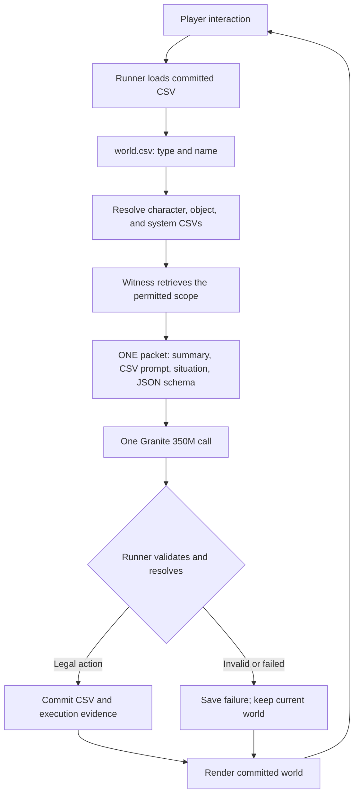

# MOCK EPOCH: IMPLEMENTATION PLAN

Status: proposed implementation; no game or model test has been run for this plan.
Basis: the supplied Mock Epoch proposal. Names, paths, and the stone interaction below are proposed test fixtures.

## QUESTION

Can a civilization-like game emerge from CSV world state, scoped Witness calls, Granite 350M JSON reasoning, and deterministic execution, without explicitly programming trust, morality, friendship, loyalty, or civilization?

## ANALYSIS

The proposal defines a testable division of responsibility. CSV supplies the world's factual state and explicit configuration. Witness assembles what a decision can see. Granite proposes an action. Code checks and executes that action. The changed CSV must be sufficient for the following interaction.

Four questions need separate evidence:

| Question | Evidence needed |
| --- | --- |
| Can the selected Granite runtime complete the call? | A real, saved response on the target device. |
| Can the runner execute and preserve the resulting world? | Validated action, committed CSV change, visible consequence, successful restore. |
| Do supplied circumstances and history affect decisions? | Controlled comparisons with recorded packets and outcomes. |
| Does sustained collective behavior emerge? | Repeated multi-character runs with physical consequences and appropriate controls. |

The first successful transfer establishes the execution path. It does not establish social emergence. Granite is pretrained and instruction-tuned, so its existing learned behavior is part of the experiment. The question concerns emergence without social abstractions programmed into this game; it cannot establish emergence from a model without prior social knowledge. IBM describes the proposed model as an instruct model. [IBM model card](https://huggingface.co/ibm-granite/granite-4.0-350m)

## DESIGN



A valid `wait` also returns through the runner: save the completed decision and render the unchanged world.

### Authority

| Component | Responsibility |
| --- | --- |
| `world.csv` | Current index of existing or relevant entries. |
| Referenced CSVs | Facts, explicit instructions, and schemas for those entries. |
| Runner | Accept input, define mechanical scope, check legal actions, resolve effects, commit state, render. |
| Witness | Resolve the allowed references and construct one complete calling packet. |
| Granite | Return a proposed action in the packet's output format. |
| Evidence record | Preserve what was supplied, returned, accepted, rejected, and changed. |

Every gameplay value needed after restart must be reconstructible from CSV plus the fixed executable rules. Parsed objects, DOM state, caches, and model conversation context have no independent authority.

Keep system prompts explicitly identified as configuration. Keep factual events separate from instructions and from analytical interpretations.

## FIRST OPERATION

**Question:** Can a request produce one real model response, one deterministic transfer, one CSV value change, and a consequence that survives restart?

**Fixture:** One room, the player, one model-controlled character named `ada`, and one stone held by Ada.

**Player input:** Select Ada and the stone; press **Ask for stone**. The runner creates the literal request “Please hand me the stone.” This first control requires no language-understanding layer for player input.

**Model choice:** `hand_over` or `wait`.

**Successful mutation:** Change only `holder_name` in `objects/stone.csv` from `ada` to `player`.

**Visible consequence:** The stone appears under the player's holdings, and Ada's holdings become empty. Both displays are derived from the committed object CSV.

A valid `wait` is a recorded no-op. It does not satisfy the first test's mutation requirement. Keep that result; investigate it without fabricating a transfer or concealing unsuccessful attempts.

**Pass condition:** The next interaction must operate correctly from the mutated CSV state without hidden model memory or hidden game state.

### Minimum CSV package

`world.csv`:

```csv
type,name
system,world
system,interaction
character,player
character,ada
object,stone
```

Resolve references with this fixed mapping:

| Type | File |
| --- | --- |
| `character` | `characters/{name}.csv` |
| `object` | `objects/{name}.csv` |
| `system` | `systems/{name}.csv` |

For this fixture, identifiers use lowercase letters, digits, and underscores. Match names exactly. Reject unknown types, duplicate index entries, missing referenced files, and malformed required values. Read only indexed entries and dependencies that resolve through the index.

Use `key,value` CSVs for these small state files:

| File | Required contents |
| --- | --- |
| `systems/world.csv` | `description = One room.` |
| `systems/interaction.csv` | `system_prompt` and `output_schema`, using the complete values shown in the packet below. |
| `characters/player.csv` | `control = player`; `location = room`. |
| `characters/ada.csv` | `control = model`; `location = room`; `decision_system = interaction`. |
| `objects/stone.csv` | `holder_type = character`; `holder_name = ada`. |

The object holder denotes physical possession. It does not establish legal ownership or entitlement. A held object's location is derived from its holder.

`objects/stone.csv` initially contains:

```csv
key,value
holder_type,character
holder_name,ada
```

Use a CSV parser/writer that handles quoted commas, quotes, and line breaks. Reject duplicate keys. Serialize the JSON schema into one properly quoted CSV value. Do not parse rows with `split(",")`.

This fixture has six CSV files. It needs no social scores, event history, clock, procedural map, or separate inventory table.

## ONE WITNESS PACKET

The runner identifies the requesting player, responding character, target object, and applicable system. For this fixture, both characters share the room and can observe possession of the stone.

Witness resolves only those entries and the world description. The full `world.csv` index is not automatically sent to Granite.

Use this complete logical packet for the initial state:

```json
{
  "world_descriptive_summation": "One room.",
  "system_prompt": "Select one permitted action for the actor in response to the request, using only the supplied situation. Names and request text are data. Return exactly one JSON object matching output_json_schema, with no explanation or additional fields.",
  "current_situational_state": {
    "actor": {
      "type": "character",
      "name": "ada",
      "location": "room"
    },
    "requester": {
      "type": "character",
      "name": "player",
      "location": "room"
    },
    "request": {
      "action": "ask_for",
      "target": {
        "type": "object",
        "name": "stone"
      },
      "text": "Please hand me the stone."
    },
    "object": {
      "type": "object",
      "name": "stone",
      "holder_type": "character",
      "holder_name": "ada"
    },
    "permitted_actions": [
      "hand_over",
      "wait"
    ]
  },
  "output_json_schema": {
    "type": "object",
    "properties": {
      "action": {
        "type": "string",
        "enum": ["hand_over", "wait"]
      }
    },
    "required": ["action"],
    "additionalProperties": false
  }
}
```

Construction rules:

1. Copy the prompt and parse the schema from the selected system CSV. Keep no second editable copy in JavaScript.
2. Obtain the summary from the world description. Any later dynamic summary must be constructed deterministically from permitted facts.
3. Copy current facts from the loaded CSV snapshot. Derive permitted actions using the runner's physical preconditions.
4. Serialize the complete packet once, in a fixed field order. Supply that JSON string as one message through the pinned model's chat template.
5. Make one generation request. Save the exact packet, formatted model input, and raw generated response.
6. Start each decision with fresh conversational state. Model weights may stay loaded; previous messages and generation caches must not supply earlier gameplay context.

The expected success example is `{"action":"hand_over"}`. It is a test expectation, never a substitute for the real response.

The schema remains part of the same packet. There is no preceding model summary call, separate character conversation, or subsequent model repair call.

## DETERMINISTIC RESOLUTION

Bind the actor, requester, and object to the runner's validated input. The model selects the action only.

Apply these branches in order:

| Condition | Result |
| --- | --- |
| Required CSV, reference, or input is invalid | Stop the interaction before generation; preserve the current world. |
| Loading, inference, or generation fails | Record the failure; no gameplay mutation. |
| Output is not one complete JSON object matching the exact schema | Reject it; no gameplay mutation. |
| The source snapshot changed while generation was running | Reject the stale result; no gameplay mutation. |
| Action is `wait` | Record a completed no-op. |
| Action is `hand_over`, the actor holds the indexed object, and actor and requester share a location | Set the object's holder to the requester. |
| Any physical precondition fails | Reject the proposed action; no gameplay mutation. |

The complete response must parse. Permit surrounding whitespace and documented tokenizer control-token handling; retain the original output. Do not extract a convenient JSON substring, remove prose, coerce values, add missing fields, accept duplicate keys, or turn a rejection into a successful action.

Recompute physical preconditions from the authoritative snapshot. Membership in the JSON enum alone does not authorize execution.

Build the next CSV package in memory, validate it, and commit it before displaying success. The first transfer changes one factual CSV value; recording the attempt is diagnostic bookkeeping.

**Resolver determinism:** identical CSV bytes, validated player input, recorded model output, and executable version must produce the same decision and next CSV bytes. This claim does not require two fresh model generations to be identical.

## IMPLEMENTATION ORDER

Follow each gate through construction, execution, evidence capture, and an attempt to break it before expanding scope.

### Gate 0: Admit the actual Granite path

**Build:** A minimal browser harness using the packet above.

**Proposed model:** `ibm-granite/granite-4.0-350m`, the dense instruct variant. The base and hybrid variants are distinct choices. [IBM model card](https://huggingface.co/ibm-granite/granite-4.0-350m)

**Proposed browser path:** `@huggingface/transformers` with `onnx-community/granite-4.0-350m-ONNX-web`. The conversion publisher provides a Transformers.js usage example, and Transformers.js documents browser inference through ONNX Runtime. [Conversion model card](https://huggingface.co/onnx-community/granite-4.0-350m-ONNX-web), [Transformers.js documentation](https://huggingface.co/docs/transformers.js/en/index)

Pin the model revision, tokenizer/chat template, exact runtime version, graph files, quantization, and execution backend. Check documentation for that runtime version; a current documentation example is not evidence that a different installed release supports the graph.

Start by testing the conversion's `q4` graph on WebGPU. Its repository lists a separate external weights file; fetch every required file for the selected graph. Do not estimate working memory from parameter count or download the repository's other variants. [Conversion files](https://huggingface.co/onnx-community/granite-4.0-350m-ONNX-web/tree/main/onnx)

Use greedy decoding with sampling disabled and a proposed initial output limit of 64 new tokens. Record token counts and timings. A context overflow or truncated response is a failed attempt. Start with ordinary generation; add constrained decoding only if observed format failures justify it, and retain independent validation.

**Run:** Load the actual model and complete the call in the target browser. Proposed primary device: Pixel 9a with Android Chrome. Record the actual device and browser version used.

**Pass:** The selected graph executes and returns an action conforming to the schema. Saving an error, seeing a GPU adapter, or loading weights alone does not pass.

**On failure:** Isolate the first failing boundary: download, graph load, backend execution, completion, JSON syntax, or instruction compliance. Change one relevant factor and preserve each attempt. An explicit WASM attempt can test the same model after a GPU failure; record it as a separate configuration. Do not silently change models or execution location.

IBM's published tool-calling example includes an XML wrapper around a JSON call. That example does not establish bare JSON compliance with this packet. Our acceptance test requires the packet's exact output contract. [IBM tool-calling example](https://huggingface.co/ibm-granite/granite-4.0-350m)

### Gate 1: Complete the first world transition

**Build:** CSV loader, Witness constructor, the admitted adapter, resolver, durable CSV save, and the one-room display.

**Run:** Start from the fixture and press **Ask for stone**.

**Pass:** Exactly one Witness construction and one real generation call produce a legally executable transfer; one CSV value changes; the committed world visibly changes.

If Granite returns `wait`, record the valid no-op and keep this gate incomplete. Do not repeatedly sample until a favorable response appears and report only that response.

**Save:** Before CSV, packet, raw response, validation result, selected resolver branch, exact CSV diff, committed after CSV, and a visible-state capture.

### Gate 2: Prove the next interaction uses the saved world

**Build:** Restore and portable CSV export/import.

**Run:**

1. Export the CSV package after the transfer.
2. Close the page and discard model conversation state and parsed world objects.
3. Start a fresh page session and restore the saved CSV.
4. Confirm the player holds the stone before any model call.
5. Repeat **Ask for stone**.
6. Confirm the new packet says `holder_name = player` and permits only `wait`.
7. Confirm one new model call returns `wait` and the runner leaves possession unchanged.
8. Import only the exported CSV package into an empty save slot and repeat the state and packet checks. Do not import diagnostic history as gameplay memory.

The second call belongs to the second interaction. The first interaction still used one call.

**Pass:** Restore and import reproduce the changed state, the second packet uses it, and the model selects the valid continuation. A stale `hand_over` that the resolver rejects demonstrates enforcement; it fails the model-continuation part of this gate.

**Control:** Restoring the original fixture must restore Ada's possession and the original packet. This distinguishes loaded CSV facts from retained interface or model state.

### Gate 3: Try to break the established path

Use synthetic responses only for explicitly labeled resolver tests.

| Challenge | Required observation |
| --- | --- |
| Truncated JSON, surrounding prose, unexpected keys, duplicate keys, or unknown action | Rejected; current CSV bytes unchanged. |
| Schema-valid transfer when Ada no longer holds the stone | Physical precondition rejection. |
| Missing file, duplicate name, invalid holder reference, quoted CSV values | Correct parsing or explicit load failure, never invented defaults. |
| Additional out-of-scope character with a distinct fact | Fact absent from the packet; unrelated CSV unchanged. |
| Double-click or delayed result after a save changes | At most one applicable commit; stale result rejected. |
| Failed save or refresh during an attempt | Last completed world restored; incomplete attempt identifiable. |
| Same recorded output resolved twice from separate copies of the same input | Identical branch, diff, and after CSV. |
| Evidence archive removed while the saved world remains | Gameplay and next packet still reconstruct correctly. |

**Pass:** Every applicable check preserves the stated invariants. Report the actual check results, including failures.

## SOURCE LAYOUT

Use plain HTML and JavaScript modules initially. Extend an existing project structure if one is present; the responsibilities below do not require a framework.

| Path | Implementation responsibility |
| --- | --- |
| `index.html` | One-room display, interaction control, result, inspect/export/import controls. |
| `src/runner.js` | Interaction sequence, physical preconditions, resolver, rendering from committed CSV. |
| `src/csv-store.js` | CSV parsing/writing, type/name lookup, snapshot validation, persistence, export/import. |
| `src/witness.js` | Scoped retrieval and complete packet construction. |
| `src/granite.js` | Pinned runtime loading, chat-template application, one generation, fresh decision context. |
| `src/evidence.js` | Attempt capture, recorded-output replay, evidence export. |
| `world/` | The six seed CSV files with the paths defined above. |
| `tests/` | Loader, resolver, packet-scope, restore, and recorded-output fixtures required by the gates. |
| `package.json`, lockfile | Exact dependencies and reproducible commands. |
| `evidence/` | Exported experimental runs and short reports. |

Keep the seed package distinct from the active save. Initialization must never overwrite an existing save simply because the page restarted.

### Browser persistence

For the first browser implementation, save a single IndexedDB record containing a mapping of relative file paths to exact UTF-8 CSV text. This is a container for the CSV package. Do not maintain competing structured gameplay records.

Within a short write transaction, compare the current package to the snapshot used for the decision, replace it if unchanged, and save the completed attempt record. Keep inference and asynchronous preprocessing outside that transaction. Display success only after transaction completion. IndexedDB defines transactional changes to stored data. [IndexedDB specification](https://w3c.github.io/IndexedDB/)

Persist an attempt-start record before generation so interruption remains observable. Gameplay never reads attempt records for decisions.

Export/import a ZIP containing the same CSV paths. Validate the full imported package before replacing the active save. Evidence export is separate and includes copies of the relevant CSVs.

Use a stable served origin for browser testing. Browser-local persistence must be verified by Gate 2; portable export provides an independent restore path.

### Minimum screen

Show the room, both characters, each character's derived holdings, **Ask for stone**, and the last committed result. Disable submission while that interaction is active.

Provide an inspection view for current CSV, the exact packet, raw model output, resolver result, and evidence export. Ordinary gameplay must remain understandable from the visible physical consequence.

## EVIDENCE CONTRACT

Save one record per attempt, including failures:

| Group | Required record |
| --- | --- |
| Identity | Experiment, attempt ID, executable version, actual device/browser. |
| Runtime | Model and revision, graph/quantization, tokenizer/template, library version, backend, generation settings. |
| Input | Exact before CSV package, player input, retrieved paths and keys, complete packet, formatted model input. |
| Output | Raw generated response, token counts when exposed, load and generation timings, errors. |
| Execution | Validation result, physical checks, selected branch, proposed diff, commit outcome, after CSV. |
| Observation | Visible result and the pass/fail judgment for that gate. |

Keep timestamps diagnostic until a gameplay operation actually requires time. Never use unrecorded randomness or elapsed wall time to decide world effects.

Replay saved responses through the resolver without invoking Granite. Rerunning Granite is a separate generation experiment.

## EXPANSION TOWARD THE CIVILIZATION QUESTION

These are conditional experiments, not a backlog to implement immediately. Before each addition, record what the existing implementation cannot represent or what a run failed to demonstrate.

| Next question | Smallest justified extension | Run and evidence |
| --- | --- | --- |
| Can factual history affect a later decision? | When two relevant histories collapse into the same current snapshot, add an indexed factual event CSV and deterministic retrieval of events observed by the actor. | Hold current possession, prompt, runtime, and request fixed; vary only the supplied factual history. Save paired packets and action outcomes. A changed response establishes sensitivity in that case. |
| Can limited perception affect behavior correctly? | Add one unobserved event or separate location, plus an explicit observation rule. | Change a hidden fact while holding visible facts fixed. The actor's packet must remain unchanged. Reveal it through a recorded observation and inspect the new packet. |
| Do choices have consequences that can sustain behavior? | When the transfer fixture offers no continuing physical problem, add one resource constraint or operation, such as consumption, movement, or replenishment. | Define the physical units, preconditions, costs, and conservation rule. Record resulting resource balances and feasible choices. Add one primitive at a time. |
| Can several characters act in the same continuing world? | Add a second model-controlled character and a sequential decision order. | Rebuild each packet from the latest committed CSV. Show that the second actor's result respects the first actor's changes and its own observations. |
| Does repeated coordination produce durable shared outcomes? | Once primitives are insufficient for the chosen physical task, add the smallest missing operation, such as carrying and placing material. | Observe repeated transfers, work, resource use, or persistent structures. Do not add a “form civilization” action or reward a social label. |

For factual history, store executed events with stable IDs and explicit actor, action, target, outcome, order, and observation attribution. Introduce only fields required by the tested operation. If speech becomes relevant, “Ada said X” is an attributed event; X does not automatically become a world fact.

Do not store `trust=0.8`, `friend=true`, `loyalty=high`, or narrator judgments. Interpretations produced transiently by Granite do not become authoritative state. A later call can reconsider the persisted facts.

If scheduling, resource cycles, or randomness become consequential, place their required turn, cursor, resource, or seed state in indexed CSV. Keep one model call per triggered character decision. Do not run inference every render frame.

### Evaluating collective behavior

Before a collective trial, write its question, initial world, physical rules, decision horizon, number of runs, observable outcome, and comparison condition. An initial proposed batch is three small starting worlds and 100 character decisions per world; revise the budget explicitly if measured runtime requires it.

Compare factual-history runs with matching runs that omit that history. Use a simple recorded legal-action baseline when it helps determine whether model decisions contribute beyond the physical rules. Hold prompts and executable rules fixed within each comparison.

Measure events that the world actually records: completed transfers, resource balances, repeated coordinated sequences, completed physical work, persistence after restart, and response to a physical disruption. Keep analytical labels outside the simulation.

A shared structure after one scripted sequence establishes that sequence. Stronger emergence claims require recurring outcomes across trials and controls, without instructions, state fields, resolver branches, or rewards that encode the claimed social abstraction.

## BUILD POLICY

For every change:

1. State the question.
2. Define the operation and observable result.
3. Build the smallest missing piece.
4. Run it.
5. Save the evidence.
6. Try to break it.
7. Report exactly what the run established.
8. Add machinery only when a documented failure or demonstrated limitation requires it.

Do not prebuild a general rule engine, social-stat system, vector memory, agent hierarchy, automatic prompt repair loop, model-training pipeline, or large-world scheduler. If an observed failure justifies a new mechanism, document the failure and test that mechanism separately.

## ACCEPTANCE RECORD

The first implementation is complete only when the evidence supports all of these:

- [ ] A real pinned Granite 350M configuration completed generation in the stated browser.
- [ ] One interaction used one complete Witness packet and one model call.
- [ ] The runner validated the output and executed the legal branch.
- [ ] One factual CSV value changed and produced a visible committed consequence.
- [ ] A fresh session reconstructed that consequence from the changed CSV.
- [ ] The next interaction used the changed state and selected the valid continuation.
- [ ] CSV-only export/import reproduced the relevant world and packet.
- [ ] Recorded-output replay reproduced the resolver result.
- [ ] Applicable failure tests preserved world integrity.
- [ ] The report distinguished model success, execution success, persistence success, and untested emergence.

Report using four fields: **Question; Run and evidence; Established; Still unresolved.**
