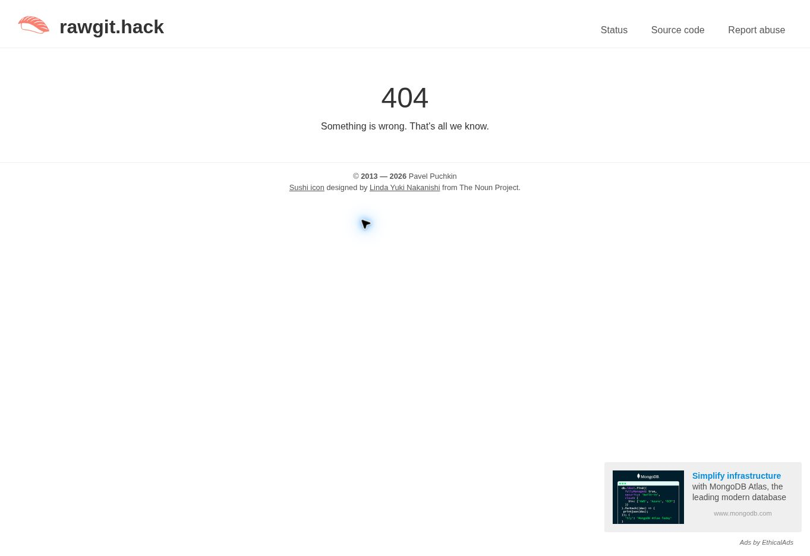

# Read/resolve/render iteration

Run: 2026-09-14, 21:10 UTC. Base: `88938bd723356f4bb88c00da62eede3981d3863e`.

Question: can the indexed CSV facts be loaded into one direct in-memory representation and displayed, with possession derived from the object's holder references?

## Implementation

`app.js` holds index rows and a map of key/value maps keyed by indexed `type/name` references. The CSV cells remain strings. The renderer reads those records and derives displayed holdings afresh; it keeps no character inventory or other independent gameplay facts. `index.html` supplies the display and a loading/error message.

## What ran

The application's unchanged `loadWorld` and CSV reader functions were executed in Node.js v24.19.0 against a disposable copy served over local HTTP by Python 3.12.14. A temporary execution context supplied native HTTP fetch with the local base URL. It did not execute the browser entry point or renderer, and did not simulate a DOM.

For the original seed, the index and every referenced key/value row were compared with an independent Python standard-library CSV read. All matched, including the exact decoded `system_prompt` and `output_schema` strings. The schema string also parsed as JSON with the existing `hand_over` and `wait` choices. This was a data-read check, with no model call.

| Agreed case | Input in disposable copy | Observed read/resolve result | Visible browser result |
| --- | --- | --- | --- |
| Original seed | Stone has `holder_type,character` and `holder_name,ada` | PASS: six CSV requests returned 200; five records resolved; holder was `character/ada` | Blocked; not verified |
| Changed holder | Only `holder_name,ada` changed to `holder_name,player` | PASS: a fresh load read `character/player` as holder | Blocked; not verified |
| Missing reference | Original holder restored, then `world/objects/stone.csv` temporarily removed | PASS: loading rejected with `world/objects/stone.csv: HTTP 404` | Blocked; not verified |

`node --check app.js` also passed. The original test seed was restored. The committed seed CSVs were never changed. No test harness or dependency was added to the project.

## Blocked execution

The connected Cloud browser rejected `http://127.0.0.1:8765` with `net::ERR_BLOCKED_BY_CLIENT`. Its subsequent diagnostic explicitly identified the Cloud browser URL policy and prohibited workarounds. No application screenshot or visual outcome was obtained.

An initial local reader attempt also failed before assertions with `ECONNREFUSED` against a separately launched server. The successful reader run started and stopped its local server within the same execution session.

These results establish CSV reading, indexed resolution, and loader rejection for the three inputs. They do not establish browser module execution, visible rendering, browser reload behavior, or visible error handling. The complete read/resolve/render milestone remains unproven.

## Remaining manual checks

Use a disposable copy and the local server command in the README:

1. Open the original seed in Chrome. Confirm `One room.`, both characters at `room`, player holding nothing, and Ada holding `stone`.
2. Change only the stone's `holder_name` to `player` and reload. Confirm player now holds `stone` and Ada holds nothing.
3. Restore the stone CSV, temporarily remove that file, and reload. Confirm the world stays hidden and the page says `Could not load world: world/objects/stone.csv: HTTP 404`.

Restore the original seed after the checks and record the actual visible results. Finish this verification before beginning Witness. No Witness packet, Granite response, resolver outcome, gameplay mutation, persistence, or civilization-like behavior was exercised in this iteration.

## GitHack delivery attempt: 2026-09-14, 22:14 UTC

The current `main` was re-read at `db7be782418816d54ddc65310d76ec3c43d2d864`. The app code, index, and all five referenced CSV files were unchanged from the preceding iteration. The existing installable WebApp product framing remains in place; this operation only introduces a documented development URL.

In the connected real Chrome browser, opened:

[Commit-pinned development URL](https://raw.githack.com/NFDFLDTHRY/MochEpoch/db7be782418816d54ddc65310d76ec3c43d2d864/index.html)

Observed sequence:

1. GitHack displayed its HTML confirmation, showing the expected repository, commit, and `index.html` path.
2. Selected **Open the page**.
3. The same URL displayed GitHack's own `404` page: `Something is wrong. That's all we know.` The MochEpoch interface did not appear.
4. Authenticated GitHub repository metadata returned `private: true` and `visibility: private`. The documented GitHack path requires publicly retrievable source; it cannot use this connector's authenticated access to the private repository.

This is an entry-page delivery failure, not the required missing-CSV test. No browser execution of the game was established.

| Required Chrome check | Result in this attempt |
| --- | --- |
| Original seed renders Ada holding the stone | Not reached; GitHack returned its own error page |
| Temporary holder change appears after reload | Not run; no test branch or altered seed was created |
| Missing referenced CSV produces the game's visible load failure | Not run; GitHack's 404 does not satisfy this check |

Only the development URL documentation and this delivery evidence were added. The seed remains intact, so no restoration was necessary. App code, world architecture, repository visibility, and runtime dependencies were not changed. Witness was not begun.

Next prerequisite: explicit owner authorization for source visibility sufficient for GitHack retrieval. After that, run the three existing game checks against commit-pinned snapshots and record their actual Chrome outcomes.
